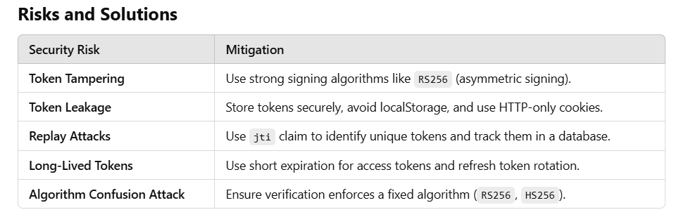
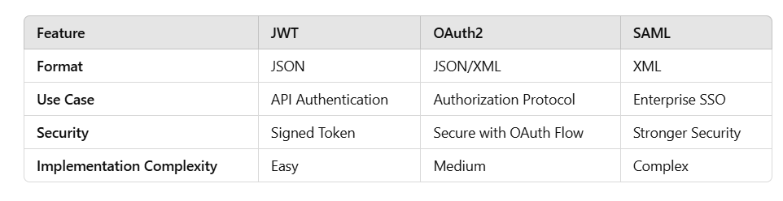
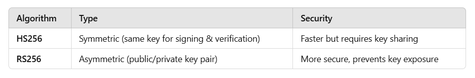

# Advanced Questions:

#### 1- How do you handle JWT expiration and refresh tokens securely?

**Concept**
JWTs typically have an expiration time (exp claim). When a JWT expires, the user needs to log in again or use a refresh token to obtain a new access token.

**<u>Secure Workflow for Refresh Tokens</u>**
**1- Short-lived access token:** The access token should have a short expiration time (e.g., 15 minutes).
**2- Refresh token storage:** Store refresh tokens securely (HTTP-only cookies, encrypted DB).
**3- Token Rotation:** When a refresh token is used, issue a new one and invalidate the old one.

**Diagram: Refresh Token Flow**

```
Client       ->   Server (JWT expired)
Client       <-   401 Unauthorized
Client       ->   Sends Refresh Token
Server       ->   Validates Refresh Token
Server       ->   Issues New Access Token
Client       <-   Receives New Access Token
```

#### 2- What are the security risks associated with JWTs, and how can they be mitigated?



- Risk: **JWT Theft →** Mitigation: Use HTTP-only, Secure cookies.
- Risk: **Expired Token Replay →** Mitigation: Implement short expiration times and refresh tokens.
- Risk: **Algorithm Tampering →** Mitigation: Only allow secure algorithms like RS256.

**What happens if an attacker steals a JWT? How do you mitigate the risk?**
If a JWT is stolen, the attacker can impersonate a user until it expires.

**Mitigation Strategies:**

1. **Use HTTPS** to encrypt token transmission.
2. **Store JWTs securely** (HTTP-only cookies instead of localStorage).
3. **Implement token revocation** (Blacklist strategy or refresh token rotation).
4. **Monitor anomalies** (Detect multiple logins from different locations).
5. Use short-lived access tokens with refresh tokens.
6. Implement **IP/device binding** for token validation.
7. Use **token hashing** before storing them in the database.

**Example: Revoke Tokens in Redis (Node.js)**

```js
const revokedTokens = new Set();
app.post("/logout", (req, res) => {
  revokedTokens.add(req.cookies.token);
  res.send("Logged out");
});
```


#### 3- Can a JWT be revoked? If so, how?

Yes, JWTs Can Be Revoked Using(JWTs are stateless and cannot be revoked once issued. However, revocation can be handled by):

- **Token Blacklist (Server-Side):** Store revoked tokens in a database or cache (Redis).
- **Short Expiry Time:** Reduce token lifetime to minimize exposure.
- **Revoking Refresh Tokens:** Store refresh tokens in the database and track their usage.

#### 4- How does JWT work in OAuth2 authentication?

**OAuth2 with JWT Flow**
User authenticates using OAuth provider (Google, GitHub, etc.).
1- The client requests an access token from the OAuth2 provider (e.g., Google, GitHub). Authorization server issues an access token (JWT) to authorize API requests.
2- Client sends JWT in API requests.
3- Resource server verifies JWT. (The server validates the JWT and grants access.)

```
User -> OAuth2 Server (Login)
OAuth2 Server -> Client (JWT Issued)
Client -> Resource Server (API Request with JWT)
Resource Server -> Verifies JWT
Resource Server -> Returns Response
```

#### 5- What are the differences between JWT, OAuth, and SAML?



- **JWT:** Token-based authentication (lightweight, API-driven).
- **OAuth2:** Authorization framework (issues JWTs).
- **SAML:** XML-based authentication (used in enterprise SSO).

#### 6- What is the role of RS256 and HS256 in JWT signing?



- **HS256 (HMAC SHA-256):** Uses a single secret key (faster, symmetric encryption).
- **RS256 (RSA SHA-256):** Uses a public-private key pair (more secure, asymmetric encryption).

#### 7- How can you prevent JWT replay attacks?

1- **Use a Nonce OR jti (JWT ID):** Store issued token IDs in Redis and check for duplicates( track unique tokens).
2- **Short Expiry Tokens:** Use refresh tokens instead of long-lived JWTs.
3- **Restrict Token Scope:** Avoid excessive privileges.
4- Implement IP-based session tracking.

#### 8- How does JWT scale in microservices architecture?

**Challenges**

- JWT validation overhead.
- Token revocation across multiple services.

**Solutions**

- Central Authentication Service: A dedicated service issues and verifies tokens.
- API Gateway Validation: Use Nginx or Kong API Gateway to validate JWTs.
- Caching Public Keys: Reduce validation overhead with a cache.

```
Client -> API Gateway (JWT Validation)
API Gateway -> Microservice 1
API Gateway -> Microservice 2
```

- JWTs allow **stateless authentication**, meaning each service can independently verify tokens without relying on a central database.
- Services validate JWTs using public keys in case of asymmetric signing (RS256).

#### 9- When would you not use JWT for authentication?

- **Session-Based Authentication:** Use cookies instead.
- **Frequent Token Revocation:** JWTs are stateless; use database-based tokens instead.
- **Large Payloads:** JWT increases request size.
