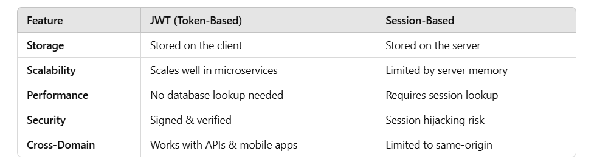

# Basic Questions:

#### 1- What is JWT, and why is it used?

**Definition:**
JWT (JSON Web Token) is a compact, self-contained, and stateless method for securely transmitting information between parties as a JSON object. It is commonly used for authentication and authorization in web applications and APIs.

**Why is JWT Used?**
✅ Authentication: Used to verify user identity after login.
✅ Authorization: Used to grant access to protected resources.
✅ Stateless & Scalable: No need to store session data on the server.
✅ Security: Signed tokens prevent tampering.

#### 2- How does JWT authentication work?

**<u>JWT Authentication Workflow:</u>**
**User Logs In →** The user submits credentials (email/password).
**Server Generates JWT →** If valid, the server creates a JWT and sends it to the client.
**Client Stores JWT →** The client stores the token (HTTP-only cookie/localStorage).
**Client Sends JWT in Requests →** Every request includes the JWT in the Authorization header.
**Server Verifies JWT →** If valid, access is granted; otherwise, rejected.

**<u>JWT Authentication Flow Diagram:</u>**

```
+-------------+       +---------------+       +--------------+       +---------------+
|   Client    |       |   Backend     |       |   API        |       |   Resource    |
+-------------+       +---------------+       +--------------+       +---------------+
      |                     |                        |                        |
      | -- 1. Login Req --> |                        |                        |
      |                     | -- 2. Validate User -->|                        |
      |                     | <- 3. JWT Response --  |                        |
      |                     |                        |                        |
      | -- 4. Send JWT -->  |                        |                        |
      |                     | -- 5. Verify JWT -->   |                        |
      |                     | <- 6. Data Access ---  |                        |
```

#### 3- What are the main components of a JWT?

**<u>JWT consists of three parts:</u>**
**Header** → Contains algorithm & token type.
**Payload** → Contains claims (user data, permissions).
**Signature** → Ensures integrity & authenticity.

#### 4- What are the advantages of using JWT over session-based authentication?


**<u>Why JWT is Better for APIs?</u>**
✅ Stateless Authentication → No need to store sessions on the server.
✅ Microservices Friendly → Can be used across multiple services.
✅ Better Performance → Reduces database queries for session verification.
✅ Scalable: Ideal for distributed systems (e.g., microservices).
✅ Efficient: Reduces server load since authentication is handled on the client side.

#### When Not to Use JWT
❌ **If You Need Immediate Token Revocation →** JWTs are stateless, so session revocation isn't instant.
❌ **If You Have Short-Lived Sessions →** Session-based authentication is simpler for short interactions.
❌ **If You Need to Store Large Data →** JWTs increase request size due to Base64 encoding.

