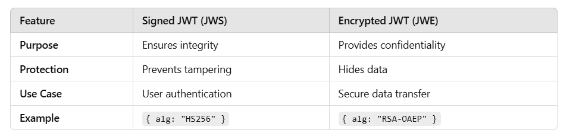

# Intermediate Questions:

#### 1-How is a JWT structured, and what are its three main parts?

**A JWT consists of three parts, separated by dots (.):**

```plaintext
Header.Payload.Signature
```

**JWT Structure (Encoded Example)**

```plaintext
eyJhbGciOiJIUzI1NiIsInR5cCI6IkpXVCJ9.
eyJ1c2VySWQiOjEsInJvbGUiOiJ1c2VyIn0.
SflKxwRJSMeKKF2QT4fwpMeJf36POk6yJV_adQssw5c
```

**<u>Three Main Parts of JWT</u>**
**Header →** Algorithm & Token Type
**Payload →** User Data (Claims)
**Signature →** Security Verification

#### 2-What is the purpose of the header, payload, and signature in JWT?

**1️⃣ Header**
Contains metadata about the token.
Specifies the signing algorithm used.
🔹 Example (Decoded Header)

```json
{
  "alg": "HS256",
  "typ": "JWT"
}
```

**2️⃣ Payload**
Contains claims (user data, permissions, expiration time).
Claims can be Public, Private, or Registered.
🔹 Example (Decoded Payload)

```json
{
  "userId": 1,
  "role": "user",
  "exp": 1710000000
}
```

🔹 Types of Claims:

Registered Claims: exp (expiration), iat (issued at), sub (subject).
Public Claims: General claims (username, role).
Private Claims: Custom app-specific claims.

**3️⃣ Signature**
Ensures the token hasn't been tampered with.
Uses a secret key to sign the token.
🔹 How the Signature is Generated

```plaintext
HMACSHA256(
  base64UrlEncode(header) + "." + base64UrlEncode(payload),
  secret-key
)
```

🔹 Example Signature

```plaintext
SflKxwRJSMeKKF2QT4fwpMeJf36POk6yJV_adQssw5c
```

#### 3-How do you verify and validate a JWT?

**✅ Verification Steps:**

Extract JWT from the request header.
Decode JWT to get the header and payload.
Check Signature using the secret key.
Validate Expiry (exp) to prevent using expired tokens.
Ensure Integrity (no tampering).

**🔹 JWT Verification Flow Diagram**

```
+------------+        +-------------+        +----------------+
|  Client    | -----> |  Server     | -----> |  Verify Token  |
+------------+        +-------------+        +----------------+
                                          |
                                          v
                               +----------------------+
                               |  Valid?  |  Expired? |
                               +----------------------+
```

#### 4-What is the difference between signed and encrypted JWTs?



**Example**
**🔹 Signed JWT (JWS)**
Token is readable, only signature is protected.
Used for authentication.

```json
{
  "alg": "HS256",
  "typ": "JWT"
}
```

**🔹 Encrypted JWT (JWE)**
Token is completely encrypted.
Used for sensitive data transfer.

```json
{
  "alg": "RSA-OAEP",
  "enc": "A256GCM"
}
```

#### 5-How do you store JWTs securely on the client-side?

❌ Avoid Storing JWT in LocalStorage!
✅ Best Practices for Secure Storage

**🔹 Best Storage Method: HTTP-Only Cookies**

```javascript
res.cookie("token", jwtToken, { httpOnly: true, secure: true });
```

**🔹 Why Avoid LocalStorage?**

Vulnerable to XSS (Cross-Site Scripting) Attacks.

#### 6-What are access tokens and refresh tokens, and how are they used in JWT authentication?

✅ Access Token → Used to authenticate API requests.
✅ Refresh Token → Used to get a new access token **without logging** in again.

**🔹 JWT Authentication Flow with Access & Refresh Tokens**

```
+-------------+        +------------+        +---------------+
|  Client     | -----> |  Server    | -----> | Access Token  |
+-------------+        +------------+        +---------------+
      |
      |--- (Token Expired) --->
      |
      v
+-------------+        +------------+        +---------------+
|  Refresh    | -----> |  Server    | -----> | New Access    |
|  Token      |        |            |        | Token Issued  |
+-------------+        +------------+        +---------------+

```
