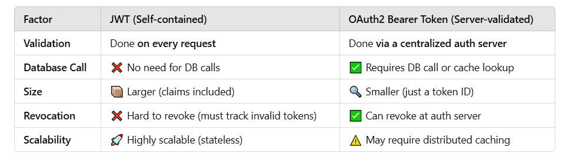
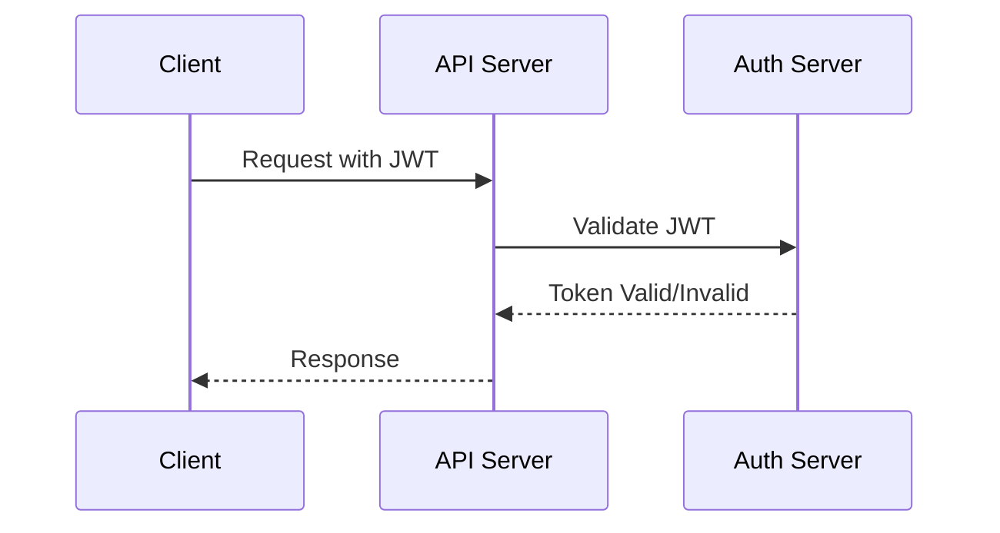

# Optimizing JWT Authentication for High-Performance APIs

## 1. Does JWT authentication impact performance? How can you optimize it?

Yes, JWT authentication impacts API performance because:

- **Token storage & retrieval**: Improper storage (e.g., in localStorage) can introduce security risks and inefficiencies.
- **Token size**: Larger JWTs increase bandwidth usage and processing time (Large JWTs increase network latency).
- JWT tokens are **stateless**, meaning each request must carry and verify a full token.
- **Token / Signature verification** (especially with RS256) is computationally expensive, especially asymmetric ones (RS256) requires computation.

#### **Optimizations**

✅ **Use efficient signing algorithms:** Use HS256 (HMAC SHA256) for performance if public/private key signing isn't required (HS256 is faster but less secure than RS256).
✅ Keep JWT payloads minimal by avoiding unnecessary claims.
✅ **Minimize token lifetime:** Use short expiration times and refresh tokens: Instead of long-lived access tokens, use short-lived tokens with refresh mechanisms. Shorter expiration reduces token misuse risks.
✅ Offload verification to a reverse proxy (e.g., Nginx with JWT verification).
✅ **Cache JWT verification results**: Avoid repeated decoding of the same JWT. Store only the user ID and retrieve full details from a database/cache.

## 2. How does using JWT vs OAuth2 Bearer Tokens impact API performance?



#### ✅ Best Practices for Performance

- Use **OAuth2 Bearer Tokens** when **you need fine-grained control (revocation, user sessions, etc.)**.
- Use **JWT** for **highly scalable stateless APIs** where token validation is decentralized (JWTs improve API performance in stateless systems.).

| Feature               | JWT                                       | OAuth2 Bearer Token                  |
| --------------------- | ----------------------------------------- | ------------------------------------ |
| Stateless             | Yes                                       | No (depends on session storage)      |
| Verification Overhead | Higher (signature validation)             | Lower (session lookup)               |
| Scalability           | High (no DB lookup needed)                | Moderate (DB session check required) |
| Security              | Prone to token leaks if stored improperly | Requires secure token storage        |

> **Optimization Tip**: If using OAuth2, prefer token introspection for security over excessive DB queries.

## 3. Can large JWT payloads slow down an application? How do you optimize JWT size?

Yes, large JWT payloads increase response time and bandwidth usage ( increase network latency and verification time).

### 📌 Optimization Techniques

- ✅ **Use compact claims**: Shorten claim names (`"sub"` instead of `"subject"`).
  ✅ **Remove unnecessary claims:** Use shorter claim names (uid instead of user_id)
  ✅ Avoid storing session data in JWT
  ✅ Use compact encoding (e.g., Base64URL)
  ✅ **Consider token compression:** (if needed, e.g., gzip before signing)

**Example**
❌ Bad JWT (Too Many Claims)

```json
{
  "userId": "12345",
  "email": "user@example.com",
  "role": "admin",
  "profile_picture": "base64string...",
  "permissions": ["read", "write", "delete"],
  "session_id": "XYZ",
  "company_info": { "name": "XYZ Corp", "address": "..." }
}
```

✅ Optimized JWT

```json
{
  "uid": "12345",
  "role": "admin"
}
```

## 4. What are the trade-offs between JWT expiration time and refresh token lifetime?

| Approach                              | Pros                      | Cons                           |
| ------------------------------------- | ------------------------- | ------------------------------ |
| Long JWT Expiration                   | Fewer refresh requests    | Higher security risk if leaked |
| Short JWT Expiration + Refresh Tokens | Higher security, scalable | Extra API call for refresh     |

### 🛠️ Best Practice

- Use **short-lived JWTs (5-15 mins)** and **long-lived refresh tokens (1 day or more)**, Short expiration (exp) **improves security** but requires **frequent re-authentication**.
- Longer refresh token lifetimes reduce login prompts but introduce **revocation challenges**.
- Rotate refresh tokens upon use to mitigate token replay attacks.

## 6. How do you optimize JWT authentication in high-traffic APIs?

- **Use caching (Redis, Memcached)**: Cache decoded JWTs to reduce verification overhead. Cache public keys (JWKS) to avoid frequent database lookups.
- Use **short-lived access tokens** with refresh tokens.
- **Asynchronous JWT verification**: Offload token validation to worker threads.
- **Minimize HTTP headers** (token size): Avoid sending JWTs unnecessarily in requests.
- **Use CDN for static token distribution** (if applicable).
- Offload JWT verification to **API gateways** (e.g., AWS API Gateway, Nginx).

## 7. What are the trade-offs between symmetric (HS256) and asymmetric (RS256) signing in JWTs?

| Algorithm          | Pros                                  | Cons                                                |
| ------------------ | ------------------------------------- | --------------------------------------------------- |
| HS256 (Symmetric)  | Faster, requires only a secret key    | Key management complexity, all parties need the key |
| RS256 (Asymmetric) | Higher security (private/public keys) | Slower, more computational overhead                 |

- **HS256 (HMAC SHA-256, Symmetric):**
  - Faster, but **requires sharing the secret key** between parties.
  - Suitable for **internal services** where the secret can be securely stored.
- **RS256 (RSA SHA-256, Asymmetric):**
  - Uses **public/private key pair** (no secret key sharing).
  - Suitable for **third-party authentication (SSO, OAuth2)**.

### 🔥 Best Practice

For internal microservices, use **HS256**. For third-party authentication (e.g., OpenID Connect), use **RS256**.

## 8.How would you handle JWT authentication in a real-time application (WebSockets, SignalR)?

### Approach

1. **Authenticate on WebSocket connection** using a JWT in the connection query. Send JWTs in the WebSocket handshake request (Authorization header).
2. **Validate JWT** before establishing a connection.
3. **Store decoded JWT in session** and use it for authorization.
4. **Periodically refresh JWT** using a refresh token to maintain an active session.

### Example WebSocket connection with JWT:

```javascript
const socket = io("https://chat.example.com", {
  auth: { token: "your-jwt-token" },
});
```

## 📊 JWT Authentication Flow Diagram



## 📌 Conclusion

- JWTs improve scalability but require optimization.
- Use short-lived tokens with refresh mechanisms.
- Reduce token size and cache verification results.
- Choose HS256 for speed, RS256 for security.
- Implement JWT in WebSockets with connection authentication.

By following these best practices, you can achieve secure, high-performance JWT authentication for your applications.
